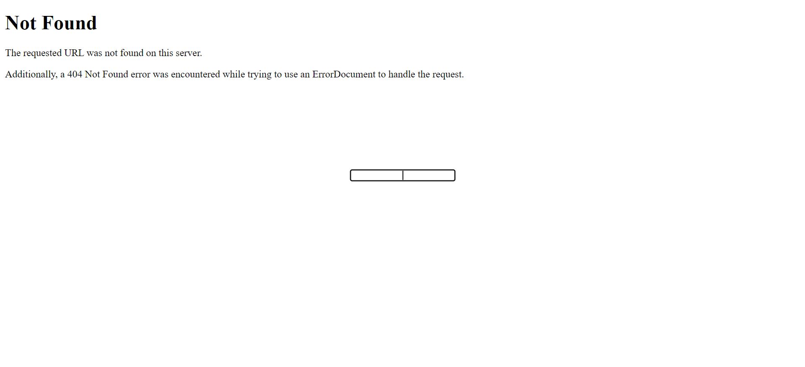
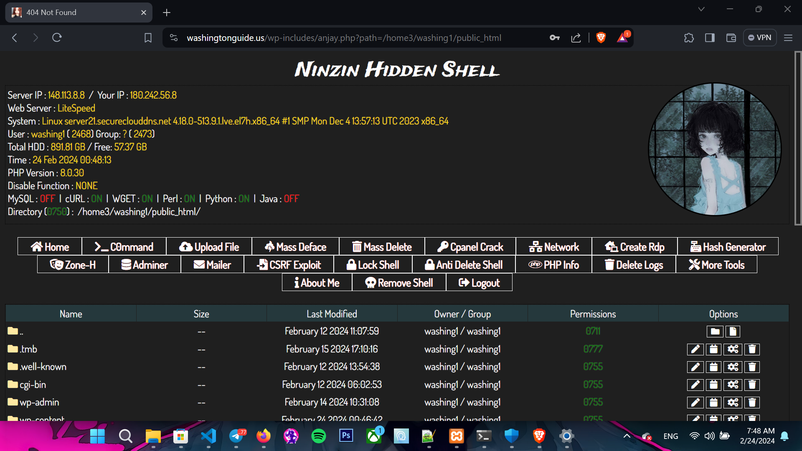

# _NinzinHiddenShell_


I created this shell For educational purposes only, any kind of illegal use is prohibited and the developer is not responsible for any misuse or damage caused by this program.<br/>


# _Feature:_

- [x] **Responsive Design**
- [x] **php 7.x issue resolved**
- [x] **Easy to use**
- [x] **Hidden password login protection**
- [x] **Server Infection possibille**
- [x] **Mass Deface**
- [x] **Mass Delete**
- [x] **Cpanel Crack**
- [x] **Back Connect**
- [x] **Create RDP**
- [x] **Hash Generator**
- [x] **Zone-H Notifier**
- [x] **Adminer**
- [x] **Mailer**
- [x] **CSRF Exploit**
- [x] **Lock SHell**
- [x] **Anti Delete Shell**
- [x] **Delete Logs**
- [x] **PHPINFO**
- [x] **And More**
- [x] **No Tracker**
- [x] **No Logger**
- [x] **More useful features...**

 ______________

|               | Default                | Personal?                       |
| ------------- |:----------------------:| -------------------------------:|
| Password      | __xzourt123__           |  (__base64 hash__)  |

 ______________
 

# _Tutorial:_ https://youtu.be/9VMwSeQQt7I?si=ogH9ZXeJZbT8jv-W


### PREVIEW

</img>  </img> 
 ______________
 

### LEGAL DISCLAMER

``` The author does not hold any responsibility about the bad use of this tool/script,
remember that attacking targets access to private files without permissions is illegal and punish
by law, this tool/script was build to show how resource files can automate tasks.
```
